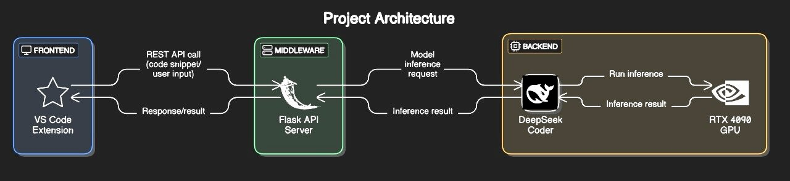

# ✨ CodeGenie — Your AI-Powered Coding Companion

_CodeGenie_ is a smart VS Code extension that serves as your personal code assistant. Just type a prompt like “Write a Python class for a linked list,” and CodeGenie instantly generates accurate, syntax-aware code — right inside your editor.

Built using the powerful **DeepSeek Coder** model and optimized for **GPU-based inference**, CodeGenie brings intelligence, speed, and convenience to your development workflow.

## 🎯 Purpose

Modern developers often struggle with repetitive coding, boilerplate, and context switching. CodeGenie solves this by offering:
- Natural language to code generation
- Inline suggestions and autocompletion
- A fast, local, and privacy-safe coding assistant

Whether you're prototyping, learning, or building full-scale projects — CodeGenie helps you code faster and smarter.

## 🛠️ Tech Stack

| Component      | Technology                           |
|----------------|--------------------------------------|
| Extension UI   | VS Code WebView (HTML, JS, CSS)      |
| Extension Core | TypeScript (VS Code API)             |
| Backend API    | Python Flask                         |
| AI Model       | DeepSeek Coder 1.3B Instruct         |
| Acceleration   | Local GPU (NVIDIA RTX 4090)          |

## 🧠 Architecture

**Flow Overview:**

1. User types a prompt in VS Code (e.g., “Create a REST API using Flask”)
2. Prompt is passed to the WebView frontend
3. The extension backend sends the prompt to a local Flask server
4. Flask routes the prompt into DeepSeek Coder for inference (on GPU)
5. Generated code is returned and displayed in the chat UI

**Technically:**
- Everything runs locally
- Fast round-trip from prompt → model → code
- Optimized for real-world use with zero external API dependency

  

  

## 🔍 Highlights from DeepSeek Coder

We’re using the **1.3B Instruct** variant of DeepSeek Coder, which offers:

- 📚 Pretraining on 2T tokens of high-quality code (multi-language)
- 💬 Instruction tuning for better prompt alignment
- 🧠 Context understanding for multi-turn code refinement
- ⚡ Efficient inference on consumer GPUs

This makes it ideal for VS Code extensions and real-time coding assistance.

## 🎥 Milestone Videos

RISHITA - [View](https://drive.google.com/file/d/1bTwDQSmYYd9vbuuYqLhpiTxREzWEEck9/view) 
SAHITHYA - [View](https://drive.google.com/file/d/1mJbF7ozxCLQqvw7FyljnopEK5JDOJiM8/view) 
DHARANI - [View](https://drive.google.com/file/d/18MQOjsWTWK4gLkTqF9GcNsz8dPn5Kjnb/view)

## 👥 Contributors

- Rishita
- Sahithya
- Dharani

## 🌱 Future Enhancements

- Prompt history and editable conversations
- Debugging hints based on errors
- Model switching for different code languages
- Code explanation and documentation generation

---
