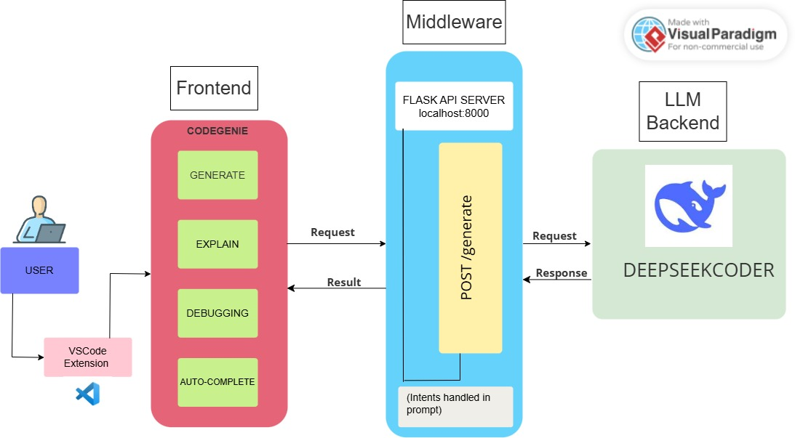

# 🌟 CodeGenie — Your AI-Powered Coding Companion in VS Code🌟

CodeGenie is your personal coding genie — living right inside VS Code!  
It listens to your prompt (like _“Create a Flask login API”_), thinks deeply, and writes syntactically correct, context-aware code — in real time.

> Powered by the blazing-fast DeepSeek Coder model and GPU inference, CodeGenie helps you code smarter, not harder.

---

## 🖥️ Purpose

Modern developers waste time on:

- Repetitive code
- Switching between docs and editors
- Writing boilerplate again and again

**CodeGenie solves all this with:**

- 🔌 Instant **natural language to code** conversion
- 👻 **Inline ghost text** suggestions
- ⌨️ **Autocompletions** with context
- 🔒 **100% local**, privacy-first setup

Whether you’re **learning**, **prototyping**, or **shipping**, CodeGenie speeds up your workflow like a true dev companion.

---

## ⚙️ Tech Stack

| Component        | Technology                          |
|------------------|--------------------------------------|
| 🧩 Extension Core | TypeScript (VS Code API)             |
| 🖼️ UI             | WebView (HTML + JS + CSS)            |
| 🧠 Backend        | Python Flask                         |
| 🤖 AI Model       | DeepSeek Coder 1.3B Instruct         |
| ⚡ Acceleration   | Local GPU (NVIDIA RTX 4090)          |

---

📎 **Workflow:**

  

1. You type a prompt in the CodeGenie panel (or code editor).
2. The extension sends it to the Flask backend.
3. The backend routes it into **DeepSeek Coder**.
4. Generated code is returned and:
   - Shown in the WebView 🪟
   - OR inserted inline 👻
   - OR used for autocompletion ⌨️

📦 **Everything runs locally**  
No external API calls. No rate limits. Full speed & privacy.

---

## 🚀 Why CodeGenie Stands Out

🧞‍♂️ **Personified Experience**  
Unlike other tools, CodeGenie feels like a true _assistant_, not just an autocomplete.

🛡️ **Fully Offline & Secure**  
No data leaves your machine. Ideal for private codebases or learning environments.

🔌 **Multi-mode Assistance**  
Supports **WebView UI**, **Inline Ghost Text**, and **Autocomplete Triggers**.

💡 **Lightweight & Customizable**  
Built using simple, extensible tools — perfect for learning, hacking, or expanding.

---

**Technically:**
- Everything runs locally
- Fast round-trip from prompt → model → code
- Optimized for real-world use with zero external API dependency

## 🧭 Architecture
  

  

## 🔍 Highlights from DeepSeek Coder

We’re using the **1.3B Instruct** variant of DeepSeek Coder, which offers:

- 📚 Pretraining on 2T tokens of high-quality code (multi-language)
- 💬 Instruction tuning for better prompt alignment
- 🧠 Context understanding for multi-turn code refinement
- ⚡ Efficient inference on consumer GPUs

This makes it ideal for VS Code extensions and real-time coding assistance.

## 🎥 Milestone Videos

RISHITA - [View](https://drive.google.com/file/d/1bTwDQSmYYd9vbuuYqLhpiTxREzWEEck9/view) 
SAHITHYA - [View](https://drive.google.com/file/d/1mJbF7ozxCLQqvw7FyljnopEK5JDOJiM8/view) 
DHARANI - [View](https://drive.google.com/file/d/18MQOjsWTWK4gLkTqF9GcNsz8dPn5Kjnb/view)

## 👩‍💻 Contributors

- Rishita
- Sahithya
- Dharani

## 🌱 Future Enhancements

- Prompt history and editable conversations
- Debugging hints based on errors
- Model switching for different code languages
- Code explanation and documentation generation

> 🧞‍♂️ **CodeGenie** isn't just a tool — it’s your magical coding partner inside VS Code.  
Let it handle the boring stuff so you can focus on building cool things.

---
